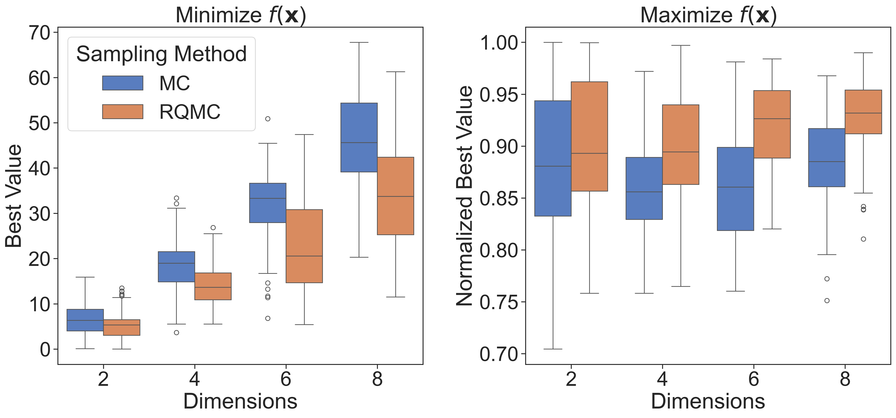

# Random Sampling Strategies

Near the time of writing this, I was researching different global optimization strategies and fell into a rabbit hole concerning the uniform sampling of high-dimensional spaces. On my way out of that hole, I thought it would be useful to create a simple write-up summarizing different random sampling strategies.

Random sampling is one of the most widely used techniques in statistics, data science, and various fields that require selecting subsets from a larger population or sample/parameter space. That said, there are numerous highly distinct sampling strategies to choose from each with their own pros and cons to consider. Here, I provide a brief introduction and discussion of a few different strategies.

## Monte Carlo (MC)

* **Pros:** Simple and widely applicable.

* **Cons:** Uneven sampling, particularly in high-dimensional spaces.

By far the most common approach to random sampling is the Monte Carlo method, or simple random sampling. This process involves drawing samples at random from some defined distribution (i.e., uniform, multivariate gaussian, etc.). In the context of global optimization within high-dimensional spaces, the most notable downside of this style of sampling is the lack of uniformity achieved across the input space. Since the sampling is random, uniformity is not enforced and sampled points may appear clustered leaving certain portions of the input space uncovered. This is easily visualized in 2D and is especially apparent for small sample numbers. This non-uniform and incomplete filling of parameter space can have a major influence on downstream integration, simulation, or learning tasks and is only partially mediated by increase the number of samples significantly.

## Stratified Sampling

* **Pros:** Better efficiency and more uniform coverage compared to simple random sampling.

* **Cons:** Still suffers in uniformity and efficiency in very high dimensions.

A simple way to improve coverage of the parameter space is through stratified sampling. One such method, known as Latin hypercube sampling (LHS), partitions the input space into equiprobable subspaces at some desired density so that each region is roughly evenly sampled.  and draws an equal number of samples from each subspace. Improvements in coverage are immediately visible in lower-dimensional spaces, however LHS and other stratified sampling methods still suffer from a lack of global uniformity due to the “curse of dimensionality” and the exponential increase in volume associated with adding extra dimensions. This causes most of the “mass” of a hypervolume to concentrate near edges of the input space. 

Below is a comparison between Monte Carlo and orthogonal array based LHS for a unit square area. Note that in the case of LHS, N = $\mathrm{p^{2}}$, where p must be a prime number. For that reason, N = 121 was chosen for reasonable comparison.

  

## Quasi-Monte Carlo (QMC)

* **Pros:** Uniform coverage in very high dimensions.

* **Cons:** Very complex with dense mathematical underpinnings, deterministic although randomness can be injected.

Quasi-Monte Carlo methods are most commonly used to approximate multivariate integrals and address the challenge of high-dimensional space filling by generating sequences of points that are designed to distribute more evenly across space, minimizing gaps and clustering. This uniformity is referred to as low discrepancy. The construction of low-discrepancy sequences involves significant mathematical complexity, which is beyond the scope of this write-up [REFS]. One of the most well-known examples of such sequences are Sobol sequences, which are widely used in fields such as financial derivative pricing (e.g., high-dimensional sampling of asset price paths), computer graphics and rendering (e.g., generating uniform, low-variance light path samples), and optimization problems in both machine learning and real-world processes (e.g., initialization in model-based or metaheuristic optimization algorithms). The term "quasi" in Quasi-Monte Carlo denotes that the values of the generated sequence are deterministic. This deterministic nature prohibits uncertainty quantification and may also introduce an unacceptable level of bias.

Below is a comparison of Sobol and Halton low discrepancy sequences. Note that Sobol sequences have poor uniformity in their two-dimensional projections. This is generally insignificant for high-dimensional applications, where QMC methods shine, however that is more difficult to visualize.

  

## Randomized QMC (RQMC)

* **Pros:** Balances randomness with the efficiency and uniformity of QMC methods.

* **Cons:** Adds complexity and requires tuning.

To address the issue of determinism, several methods have been designed to incorporate randomness into sequences while maintaining their low-discrepancy. These methods include random vector shifts, affine transformations, and bitwise operations on the binary expansions of coordinate points in the sequence (Owen scrambling + digital shift). Illustrated below are the previously computed sequences, now with randomization applied.

  

# Impact on Global Optimization

Initialization is an important step for any model-based or metaheuristic global optimization algorithm. In this application, one would like to sample high-dimensional space as uniformly as possible to provide the model/algorithm a good starting point for further optimization iterations. As a consequence, some of the most popular black-box optimization packages and services including Google's Vizier, Optuna, SMAC3, and others, regularly employ quasi-random sequences for their initial random sampling.

## Toy Problem

As a fun little exercise, I compared the performance between MC and RQMC initialization for the optimization of the Rastrigin function. The Rastrigin function is a non-convex function commonly used as a performance test problem for optimization algorithms. In an $n$-dimensional domain, the function is defined by: $f(\mathbf{x}) = 10n + \sum_{i+1}^{n} [x_{i}^2 - 10\cos(2\pi x_{i})]$, where $x_i \in [-5.12,5.12]$. The function has one global minimum at $f(\mathbf{x}=\mathbf{0})=0$, and $2^n$ global maxima located at $x_i \in [\pm 4.52299366\ldots,...,\pm 4.52299366\ldots,...]$ whose values depend on the number of dimensions. See the 2D Rastrigin function below.

  

### Experiment

For this experiment, I randomly sampled valid test points $x\in\mathbb{R}^n$ for the Rastrigin function using both MC and RQMC and fed these points as initial trials to two separate Optuna "studies". Each study consisted of a Tree-structured Parzen Estimator (TPE) sampler and was set to optimize the Rastrigin function only for 10 trials before returning the value of the best trial. This entire process was repeated 100 times for each sampling method and for each of the dimensions, $n\in[2, 4, 6, 8]$. 

Note: 
* A low number of optimization trials were deliberately chosen to emphasize the impact of initialization. Further optimization would shift the focus toward the performance of Optuna’s TPE sampler, which is not the primary objective of this analysis.
* Number of samples, N, increased with dimension to maintain a roughly equivalent sample density within each hypervolume. $\text{N}=2^{3+n}$, where $n$ represents the number of dimensions.
* Each boxplot below represents 100 initialization runs.

### Results

In the case of minimization, the effectiveness of RQMC over MC is immediately visible for all dimensions considered. This is what we would expect considering that the global minimum of the Rastrigin function is located precisely in the center of all $n$-dimensional domains. In the case of maximization, RQMC remains the superior sampling method; however, its relative effectiveness appears diminished. This can once again be attributed to the nature of the Rastrigin function. Unlike a single centrally located optimal point as was the case for minimization, the Rastrigin function has $2^n$ global maxima positioned near the edges/corners of the sample space (at least in lower dimensions). This increases the likelihood of good initializations by the MC method, particularly in lower dimensions. However, as dimensionality increases, even these maxima move exponentially farther away from the true boundaries of the sample domain. Both results underscore the importance of sample uniformity during the initialization phase of global optimization.

  

